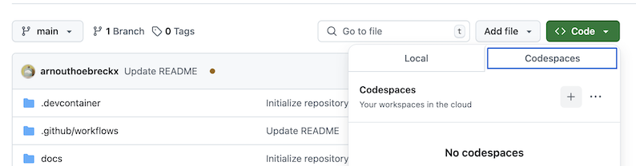
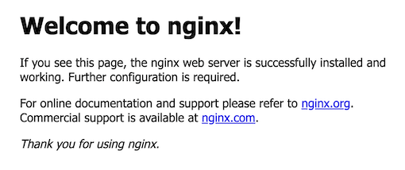
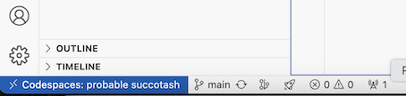
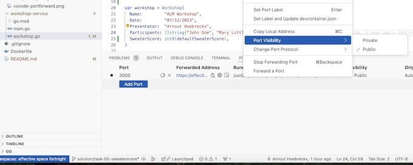
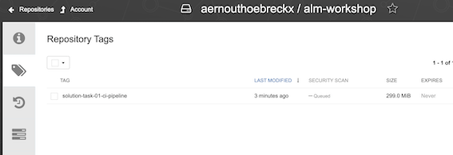
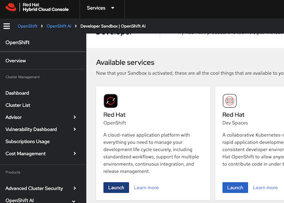
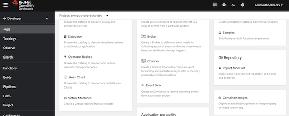
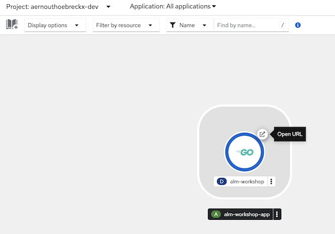
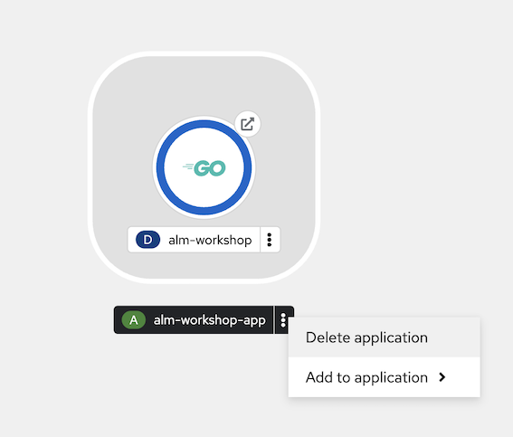

# Introduction

Hi everybody! Welcome to the ALM Workshop of 2025!

We give this workshop with a few goals in mind:
* Learn new (or unfamiliar) technologies
* Implement CI ALM concepts
    * You learned the theory, now it's time to implement

While it's easier to work with technologies that you use day-to-day, today I would like to try some technologies that you (probably) haven't really worked with yet:

* Golang
* Quay
* GitHub DevSpaces / DevContainers
* GitHub Actions
* RedHat OpenShift

# Workshop

The workshop will be divided in several tasks that each represent a checkpoint.
If one of the tasks is not working or you ran out of time you can always check-out the branch for that specific checkpoint and catch-up from there.

# Tasks

## Repository
You've been provided with basic Kubernetes manifests to deploy on an Openshift cluster in the cloud.
The industry standard way of doing this is by using Helm charts or Kustomize but these are a bit more complex so as such we're using the most basic setup.

## Devcontainer

There is another devcontainer available for you to use that has OpenShift CLI / Helm installed for you to use. Create the codespace for this repository like you did in the previous.

## Task 1

### Prerequisites

* ***Fork** the base repository to your own account!*
* Start your own CodeSpace from the "main" branch **or** run everything locally in VSCode with the devcontainers extension! (This exercise was mostly tested on the GitHub one, so safe to use that)
    
    * This can take a while (+-5mins), so don't panic.
    * You should get some pop-ups to install extensions from the devcontainer.json file
* Run the command `docker run -p 80:80 nginx` to create a NGINX container inside your devcontainer
    * VSCode should propose to open up the forwarded port with a button "Open in Browser" and you should see the NGINX Welcome page

        
        * If you missed the popup you can click on the little transmission tower in the bottom left

            
        * You can close the container in the terminal by using CTRL+C

* Go over the code & files in the repository and read the comments to explain what things do
    * ./.devcontainer/devcontainer.json = describes how your devcontainer is setup
    * ./workshop-service/* = Contains all the source code
    * ./Dockerfile = Docker multi-stage file to build & run our Go application
* Test the Dockerfile using `docker build -t test-workshop . --progress=plain` to build the image & run the image by using `docker run -p 3000:3000 test-workshop`
    * The container should be reachable on the URL provided by the GitHub workspace **or** on localhost from your browser
    * You can also surf to the /workshop endpoint

Cool! We've just managed to compile our application, without actually having to install any kind of SDK or tool manually! This is the power of the devcontainers & multi-stage docker builds for developers and can really simplify onboarding of new team members.

You can also share your links that GitHub codespaces generate when you're running your application, but by default the connection is set to private! You can change the visibilty in the same ports tab as before as you can see in the image. You will also need this later as we will want to start curl requests to the application to update the workshop.



### Task

Right now we've got a working "local" development environment from we can develop, however our goal is as followed:
* We want to be able to work with multiple developers and have consistent & repeatable builds for our application
    * We want to have some SDLC conventions to make sure that we all work in the same way
* The application should eventually be accessibly publicly, so we need to make sure that we can get the container we create in the pipeline on a system somewhere

The assignment is as followed:
* Create a [GitHub Actions pipeline](https://docs.github.com/en/actions/writing-workflows/quickstart#creating-your-first-workflow):
    * Create the directory .github/workflows and add a ci.yaml file
        * You can name the file however you want just make it clear what it does for you :)
    * Run the container build & run pipeline to create a container image artifact
        * HINT: You've already done this locally
    * Push the created container to the [quay.io](https://quay.io/) container registry using a [Robot Account](https://docs.quay.io/glossary/robot-accounts.html)
        * HINT: The image name should be as such quay.io/<quay-user>/alm-workshop to properly push
        * HINT: You might need to register the repository in quay first before you can push.
        * HINT: How will you manage your Quay Robot User password in the pipeline?
    * You should be able to see your image in Quay.io, run it inside your devcontainer to validate
        * `docker run -p 3000:3000 quay.io/<yourname>/alm-workshop:<tag>` to pull & run inside your devcontainer

            

## Task 2

* Add [SemVer](https://semver.org/) release images
    * This means that when you create a GitHub release with a certain SemVer, the pipeline should be ran again and the docker-image should be <quay-user>/alm-workshop:x.x.x
        * HINT: https://docs.github.com/en/actions/using-workflows/events-that-trigger-workflows#release
* Release your current code as version 1.0.0

## Task 3

* ***Fork** the base repository to your own account!*
* Login to RedHat Openshift Sandbox https://console.redhat.com/openshift/sandbox
  * Press "Getting started"
  * You should be able to launch OpenShift
    
* Deploy your application from the Developer menu by selecting Add+
  * If you scroll down a bit you should see "Container Images" as option
    
  * You should use your quay.io image registry URL now to deploy your application
    * Deployment Type = Deployment
    * Icon = Golang
    * Rest should be OK by default
* Your application should now be available from a remote endpoint
  * You should be transferred to the Topology view and your application should have a little arrow icon you can click to open the route.
  


This was a lot of manual effort, imagine doing this for each release! We want to automate this flow to reduce the effort to deploy but mostly to have a consistent way of doing this. Right now the process is quite error-prone.

## Task 4

We will start using IaC to make this process a bit more consistent. Kubernetes as discussed is basically one big API service that uses YAML files as interfaces to create resources. These resources are then interpreted by Kubernetes and the right actions are taken to make sure that your application is deployed as a container, has connectivity, is available from outside (ingress), ...

* Let's undeploy our previous application version first by selecting the Application in the "Topology View" and select "Delete application"
  
* Read the openshift.yaml to understand the Kubernetes resources and what they do
* Edit the Kubernetes openshift.yaml to use your Docker image
  * There's some other fields that you should also fill-in or check!
* Login to the cluster from a CLI by copying the "Login Command"
  
  * You should now be able to do `oc get pods` & get to see your pods that are running
    * `oc get deployments` will show you the deployment resource that OpenShift created for us in the previous step
    * `oc get svc` will show the services
    * `oc get routes` will show the routes & the urls from which you can connect
  * You can apply the openshift.yaml using the command `oc apply -f openshift.yaml`
  * Use `oc get pods` to see that your new pods are running
    * Use the previous commands to see the new resources that we just created.
* Create a new pipeline in this repository that automatically applies the openshift.yaml
  * Provide the correct secrets to login to the Openshift cluster from your repository.
  * Make sure that this pipeline only runs from the dev branch
  * The token that we used before is only valid for 24 hours, so we usually don't use this for automation but it's OK for this task (we will work on this later).
* Make a change in the openshift.yaml (update the replicas) and let the pipeline apply the changes
  * Validate the changes via the UI or via the CLI


We now have an automated pipeline to deploy our application to DEV! In the next task we will update our application code and get ready this change through the SDLC.

## Task 5

* Update the content of the /workshop endpoint:
    * To include yourself in the list of participants
    * Add a field "SweaterScore" that holds a numeric value of 1-10 on the presentators Christmas Sweater.
        * Provide Validation on this range.
        * The default value of the SweaterScore is setup via an environment variable.
* Release this code as 1.1.0

## Task 6

In this task we will deploy a new environment!

* Create a new branch from "dev" called "tst"
* Update "tst" branch to give different names to the Deployment, Service and Route resource
  * Update the pipeline file to run on tst branch
  * Use tst- instead of dev- if we don't update this we will have conflicts.
    * Normally we would use "Namespaces" to avoid naming conflicts, but the OpenShift Sandbox does not allow us to create multiple namespaces due to security risks
* The "tst" branch should always deploy a released version, you can deploy version 1.0.0 first and then afterwards update to 1.1.0

## Finish?

**Congratulations, you've now got a functioning code pipeline!! You can update, release and expose you're application on demand now** :clap::muscle:
The next step is to now improve upon this, so that you as a developer can focus solely on producing the code. Choose some of the extra tasks to do, in both repositories are different tasks related to their type.

## Extra's

* Do custom tags for your docker builds, right now it takes the branch name but try something as followed:
    * On "main" branch, should be tagged as such <name>:latest
    * On other branches, should be tagged as such <name>:dev-<commitHash> with the hash being a substring of 8 characters
* The dev Openshift environment should always the use the :latest image that is created when a developer pushes code to main and the build succeeds. Create a trigger in your pipeline that automatically restarts the deployment on Openshift
* Use a super-lightweight Docker base image for the Golang run image
    * Right now we're using golang for both but this is not necessary and should be changed to make the run image smaller
* Write a Go test & add tests execution to the multi-stage Dockerfile
* Add a metrics endpoint to your application that will give you insights into the application performance
* If you merge to "main" and your build succeeds at an extra step that Restarts your deployment on Openshift to redeploy the main image immediately
* Convert to Helm Chart instead of kubectl apply deploy method
  * [Helm charts](https://helm.sh/) are the most popular way of managing Kubernetes resources, because you can use advanced templating features
  * As inspiration an older repository https://github.com/arnouthoebreckx/tafun-alm-workshop-cfg
    * This was made for a quarkus-application but conceptually this can be almost fully reused for Golang
    * Don't read the README it was a different exercise back then
* Add a Horizontal Pod Autoscaler that based on amount of load (requests) to the service will automatically spin up extra pods
  * Simulate a load with Postman or just a bash while loop with curl.
* Add readinessProbes to your Deployment
  * They are used to check that the application is functionally ready to receive connections
* Deploy a Redis Helm-chart as a dependency and change the application to store a key into this Redis
  * The deployment part should be pretty easy if you've set up your Helm Chart correctly the code changes are a bit more work

# Directory structure

```
/
|── /.devcontainer
    └── devcontainer.json
|── /.github
    |── /workflows
        └── ci.yaml
|── /docs
|── /infra
    └── openshift.yaml
|── /workshop-service
    ├── main.go
    |── workshop.go
    ├── go.mod
    └── go.sum
|── .gitignore
|── Dockerfile
└── README.md
```

# Solutions / Tips

In general I tried to work in a branching structure which is named as followed solution/task-<number>-<description>

## Code repository

### Task 1 - Build pipeline

#### Application

If you want to build the application locally instead of inside the Docker container, you can try this.

**Golang**

`go run main.go workshop.go`

`go build -o ../bin/workshop -v ./...`

**POST command**

`curl -X POST -H "Content-Type: application/json" -d '{
  "name": "ALM Workshop",
  "date": "14/02/2025",
  "presentator": "AE Consultants",
  "participants": ["Arnout Hoebreckx"],
  "sweaterscore": 8
}' http://localhost:3000/workshop`

#### Docker

Some basic Docker commands that you will probably need during this exercise.

**Build**

`docker build -t alm-workshop .`

**Run / Test**

`docker run -d --rm -p 3000:3000 alm-workshop`

`curl localhost:<whatever-github-or-vscode-tells-you>`

**Rename (tag) image**

`docker tag alm-workshop:main quay.io/$QUAY_USERNAME/alm-workshop:main`

**Login to remote repository**

`docker login -u $QUAY_USERNAME quay.io`

**Push to remote repository**

`docker push quay.io/$QUAY_USERNAME/alm-workshop:main`

## Task 2 - Release

GitHub has a built-in release mechanism, that you can access through the UI. Important for the builds to check out when
